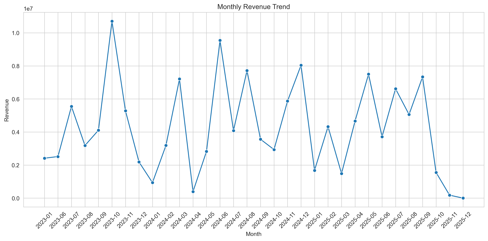
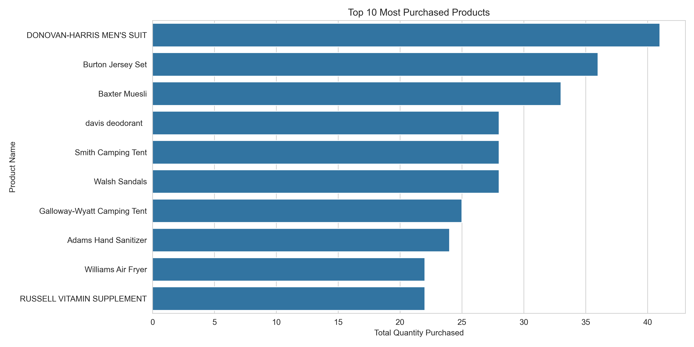
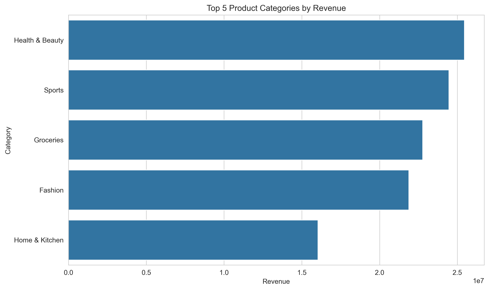
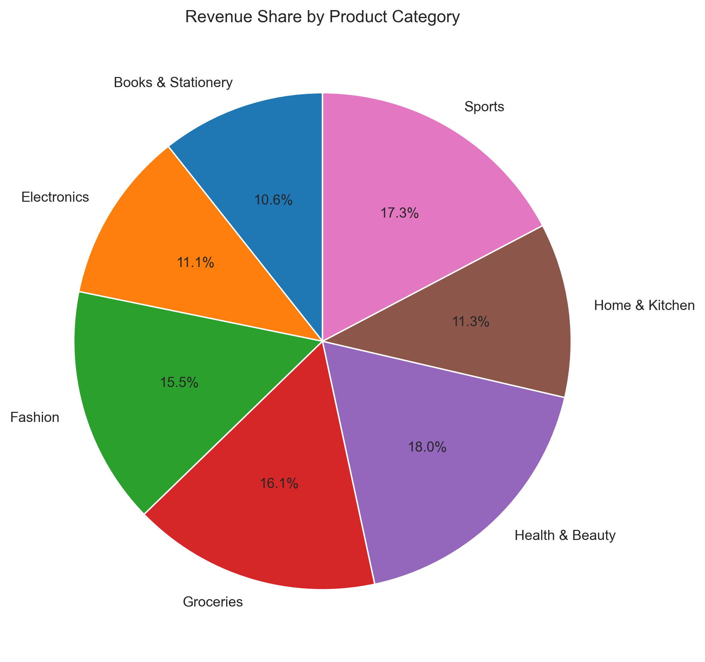
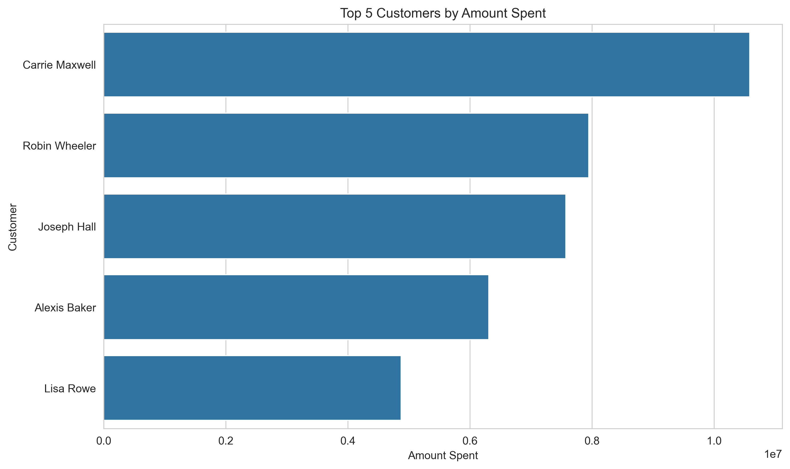

#  E-Commerce Sales Analytics 

## Project Overview

This project presents an end-to-end analysis of an e-commerce sales dataset using **Python, PostgreSQL, and SQL**.

The project demonstrates the complete data analytics workflow, including data cleaning, data validation, database integration, exploratory data analysis (EDA), and data visualization to uncover meaningful business insights.

The analysis focuses on understanding revenue performance, customer purchasing behaviour, product demand, profitability, and sales trends to support data-driven business decisions.

---

# Project Objectives

The objectives of this project were to:

* Clean and prepare raw datasets using Python.
* Load cleaned datasets into a PostgreSQL database.
* Validate data quality and referential integrity across related tables.
* Perform Exploratory Data Analysis (EDA) using SQL and Python.
* Generate visualizations to communicate key business insights.
* Provide actionable business recommendations based on the analysis.

---

# Dataset Description

The project consists of three related datasets:

### Customers Dataset

Contains customer information such as:

* Customer ID
* Customer Name
* Contact Details
* Customer Location

### Orders Dataset

Contains transactional information including:

* Order ID
* Customer ID
* Product ID
* Order Date
* Quantity Purchased
* Amount Paid
* Product Category

### Products Dataset

Contains product information such as:

* Product ID
* Product Name
* Category
* Selling Price
* Cost Price

The datasets were provided in different file formats (CSV, JSON, and TXT), requiring preprocessing before analysis.

---

#  Data Cleaning & Preparation

The datasets were cleaned and prepared using Python before loading them into PostgreSQL.

The following tasks were performed:

* Imported datasets from CSV, JSON, and TXT file formats.
* Examined dataset structure and data types.
* Verified the consistency of date and currency fields.
* Identified and handled duplicate records.
* Checked and removed unnecessary white spaces.
* Split the **Category** column into **Category** and **Sub-category**.
* Converted date fields into the appropriate datetime format.
* Validated referential integrity across the Customers, Orders, and Products datasets using primary and foreign keys.
* Merged the cleaned datasets for analysis.
* Created a **Year-Month** feature from the Order Date column to support time-series analysis.
* Exported cleaned datasets for SQL querying and Python analysis.

---

# SQL Analysis

SQL was used to perform Exploratory Data Analysis (EDA) and answer the following business questions:

1. Total Revenue Generated
2. Average Amount Paid per Order
3. Highest and Lowest Amount Paid for a Single Order
4. Top 5 Customers Who Spent the Most Money
5. Top 5 Most Purchased Products
6. Total Revenue by Product Category
7. Most Purchased Items per Month for Each Year
8. Profit and Profit Percentage
9. Monthly Revenue Trend

All SQL queries used in this project are available in:

```text
sql/business_queries.sql
```

---

# Python Analysis

After merging the cleaned datasets, Python was used to perform Exploratory Data Analysis (EDA), validate business metrics, and generate visualizations.

The following analyses were performed:

1. Total Revenue
2. Total Number of Orders
3. Average Order Value
4. Highest Order Value
5. Lowest Order Value
6. Top 5 Most Purchased Products
7. Product Category Generating the Highest Revenue
8. Top 5 Customers by Amount Spent
9. Monthly Revenue Trend
10. Customer Who Purchased the Highest Quantity

Python was also used to create visualizations that communicate key business insights from the analysis.

Libraries used include:

* Pandas
* Matplotlib
* Seaborn

---

# Visualizations

## 📊 Visualizations

### Monthly Revenue Trend



### Top 10 Most Purchased Products



### Top 5 Categories by Revenue



### Revenue Share by Product Category



### Top 5 Customers by Amount Spent



# Business Insights

The analysis revealed several important business insights:

* Revenue fluctuated across different months, indicating seasonal sales patterns.
* A small number of customers contributed a significant portion of total revenue.
* Some products consistently recorded higher purchase volumes than others.
* Certain product categories generated considerably more revenue than others.
* Profitability analysis highlighted opportunities to improve pricing and cost management.

---

# Business Recommendations

Based on the analysis, the following recommendations are proposed:

* Increase marketing efforts for high-performing product categories.
* Develop customer retention strategies for top-spending customers.
* Monitor low-performing products and review their pricing or inventory strategy.
* Leverage monthly revenue trends for sales forecasting and inventory planning.
* Regularly monitor profit margins to improve overall business profitability.

---

# Tools & Technologies

* Python
* PostgreSQL
* SQL
* Pandas
* Matplotlib
* Seaborn
* VS Code
* Git
* GitHub

---

# Project Structure

```text
Ecommerce-Sales-Analytics/
│
├── cleaned_data/
├── raw_data/
├── scripts/
│   ├── customers.py
│   ├── orders.py
│   ├── products.py
│   ├── referential_integrity.py
│   └── PDA.py
│
├── sql/
│   └── business_queries.sql
│
├── visuals/
│   ├── monthly_revenue_trend.png
│   ├── top_10_products.png
│   ├── top_5_categories_revenue.png
│   ├── top_5_customers_amount.png
│   └── category_revenue_pie.png
│
├── README.md

```

---

# Author

**Kehinde Yusuf**

**Data Analyst | SQL | Python | PostgreSQL | Power BI | Excel**

📧 Email: kehindezyusuf@gmail.com

🔗 LinkedIn:(http://linkedin.com/in/omokehinde-yusuf1)


